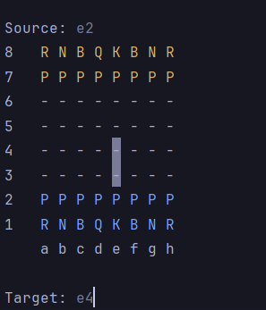

# Chess-Game

Welcome to the Chess Game in Terminal project! 

This is a simple and interactive chess game developed in Java, which can be played directly in the terminal. 

The goal of this project is to provide a classic and educational chess experience for those who want to practice or learn chess in an easy and accessible way.

## Table of Contents

- [Screenshots](#screenshots)
- [Features](#features)
- [Prerequisites](#prerequisites)
- [Installation](#installation)
- [How to Play](#how-to-play)
- [License](#license)

## Screenshots

### Initial Setup


### Moving Pieces


### Check


## Features

- Two-player chess game.
- Terminal-based chessboard representation.
- Valid moves for all chess pieces.
- Check and checkmate detection.
- Move history.
- Simple and user-friendly interface.

## Prerequisites

- Java JDK 8 or higher.
- A command terminal (CMD, PowerShell, Linux Terminal, etc.).

## Installation

1. **Clone the repository:**
   ```sh
   git clone https://github.com/gabrielssconceicao/Chess-Game.git
   cd Chess-Game

## How to play
- Movement: Players take turns to make moves. 
- To move a piece, type the move in the format e2 e4 (moving the piece from e2 to e4).
- The notation should be in the range from a1 to h8.
- Check: The game will automatically check if the king is in check after each move.
- Checkmate: If a checkmate occurs, the game will announce the winner and end the match.

## Author

This project was developed by [Gabriel Conceição](https://github.com/gabrielssconceicao)

## Licence

This project is licensed under the [MIT License](./LICENSE).